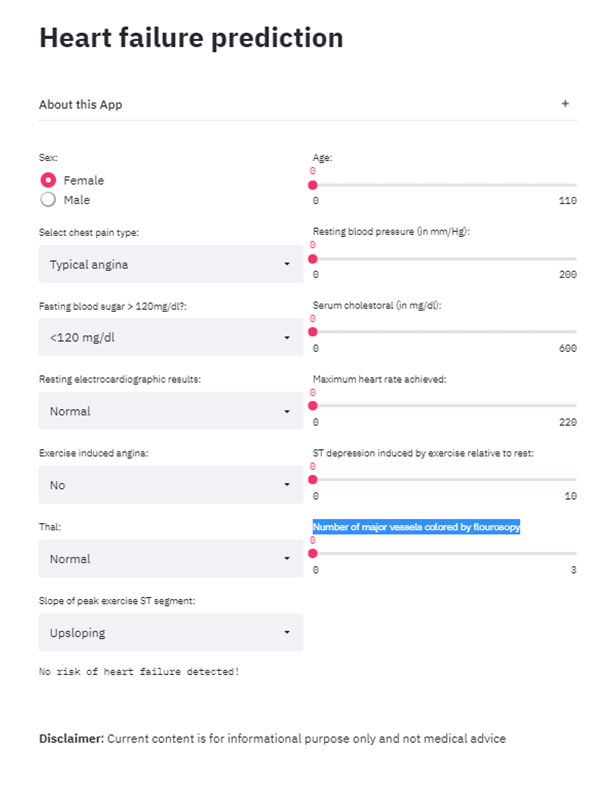

<h4 align="center">Deploying a Machine Learning Model Using Streamlit and GCP.</h4>

<p align="center">
  <a href="#about">About</a> •
  <a href="#installation">Installation</a> •
  <a href="#deployment">Deployment</a> •
  <a href="#front end">FrontEnd</a>
</p>

## About

In this project we implemented a machine learning pipeline that trains a model and provides predictions about the risk of having a heart attack. Then, we deployed our model using [Streamlit](https://streamlit.io/). The application's end point is running on Google App Engine and can be accessed through a public [url](https://share.streamlit.io/rnhondova/heart-failure-prediction-app-ui/main/heart_failure_application_ui.py). We also show how our applications performance scale-up when it receives 1K+ requests via a load test with Locust framework.

## Description of required files

> main.py : The main python file with the application code.   
> requirements.txt : List of packages needs to be installed during app deployment.   
> app.yaml : Contains environment configuration, specifying the run time configuration  
> Makefile : File containing shell commands to execute requirements.txt, linting, testing and code formatting.     
> cloudbuild.yaml : command for continuous integration in gcp, triggered by git pushes.

## Installation

Step 1: Clone this repository in enter the heart-attack-risk-model directory

```bash
$git clone https://github.com/josemoscoso-duke/heart-attack-risk-model
$cd heart-attack-risk-model
```

Step 2:Create virtual environment

```bash
$virtualenv --python $(which python3) ~/.venv
$source ~/.venv/bin/activate
```

Step 3: Use the Makefile to install required files

```bash
$make install
```

Step 4: Retrain the model, in case you uploaded a new dataset in the data folder:
```data/heart_cleveland_upload.csv```

```bash
$python train_model.py -- (optional)
```

Step 5: Run the following command to build a local instance of the web app

```bash
$python main.py
```

Step 6: Test the web app with the following bash command

```bash
$bash ./make_predictions.sh

Port: 8080
{
  "prediction": [
    "At Risk"
  ]
}
```

## Deployment

After setting up a new project on GCP  

Step 1: Ensure the current GCP cloud shell is pointing to the appropriate project.

```bash
gcloud projects describe `PROJECT_ID_OR_NUMBER`
```
In case it is not, set it with:

```bash
gcloud config set project `PROJECT_ID_OR_NUMBER`
```

Step 2: Make sure to follow this [guideline](https://cloud.google.com/source-repositories/docs/quickstart-triggering-builds-with-source-repositories) to automate App Engine deployments with Cloud Build


Step 3: Create and deploy the app in GCP

```bash
gcloud app create
gcloud app deploy
```

Step 4: Once our model is deployed on GCP we get the application [end point](https://cloud-final-project-311921.uc.r.appspot.com).


## Front End

Our application front end code is stored in this linked [repository](https://github.com/Rnhondova/heart-failure-prediction-app-ui)

This web app allows you to test different sets of parameters and returns a prediction about the risk of having a heart attack. 


